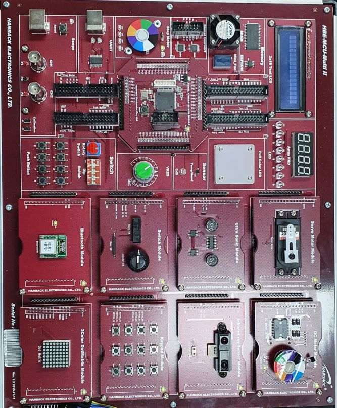

# AVR_Examples
Examples of Atmega128A
## Target Board
### HANBACK HBE-MCU-Multi II -ST   
|diagram|board|
|:---:|:---:|
|||

## 개발환경
### Microchip Studio for AVR 7.0.2594

## Directories
- basic   
  - LED : LED ON / OFF
  - toggle_LED : Delay 함수를 이용해 LED ON / OFF
  - sevenSegment : 7-segment 출력
  - switch : 버튼을 누르면 LED 출력
- Timer (prescaler : 1024 / f = 14.7456Mhz / 1024 = 14.4khz / T = 1/14.4khz == 0.0694ms)
  - Timer :
  - Timer_CTC :
  - Tiemr_PWM :
- Communication
  - Uart :  
